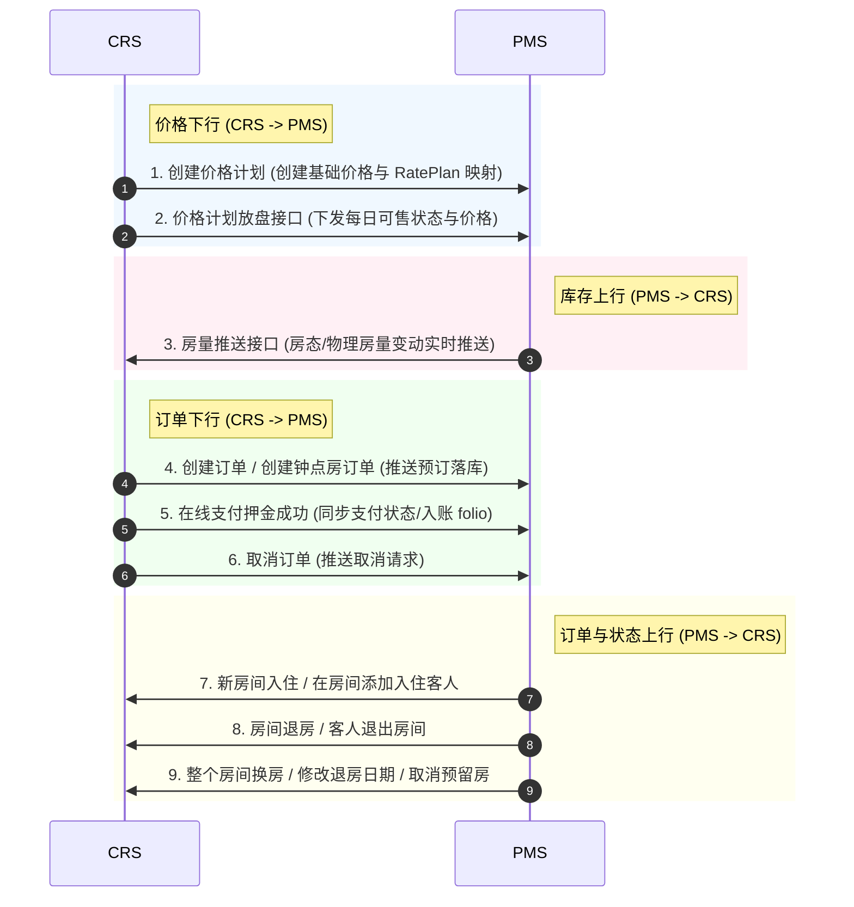

# PMS 双向集成接口与业务规范 PRD

## 1. 背景与业务目标

### 1.1 背景
为了实现集团化酒店的高效运营与线上线下渠道的实时联动，CRS（中央预订系统）需要与各门店正在使用的 PMS（物业管理系统，以 Qtels PMS 为标准规范）进行深度双向集成。通过打通价格、库存与订单三大核心数据流，实现全面自动化管理。

### 1.2 业务目标
* **价格实时下发**：集团在 CRS 制定的价格策略和 Rate Plan 能够秒级推送到各门店 PMS。
* **物理库存实时上报**：前台散客步入、脏房、维修房等引起的物理房量变化实时同步到 CRS，彻底杜绝线上超卖。
* **订单全自动落库**：线上渠道订单支付后秒级下发写入 PMS，无需前台人工录单。
* **生命周期实时互通**：前台在 PMS 上的入住（Check-in）、退房（Check-out）、取消（Cancel）和 Noshow 等操作实时回传 CRS，实现订单状态流转的闭环。

---

## 2. 核心业务流程与接口定义

### 2.1 房价模块（CRS $\rightarrow$ PMS 下行）

#### 接口 1：创建价格计划
* **业务场景**：当集团在 CRS 端新增或修改销售价格计划（Rate Plan）时，同步在 PMS 端创建或更新对应的“房价码”（Rate Code）。
* **接口规范**：
  * **调用方向**：CRS 调用 PMS 接口。
  * **核心报文**：
    * `ratePlanId` (CRS 价格计划ID)
    * `rateCode` (对应 PMS 房价码)
    * `name` (价格计划名称)
    * `roomTypeMapping` (关联房型列表)
    * `chargeType` (计费类型：`1` 日租，`3` 钟点等)
  * **约束条件**：需支持价格计划的启用/禁用状态同步。

#### 接口 2：价格计划放盘接口
* **业务场景**：CRS 负责管理未来的可售日期区间。当某段日期的房价调整或执行限制销售（Closed）时，CRS 通过此接口向 PMS “放盘”。
* **接口规范**：
  * **核心报文**：
    * `rateCode` (PMS房价码)
    * `startDate` / `endDate` (放盘起止日期)
    * `prices` (每日价格列表，含 `roomTypeId`、`date`、`price`)
    * `status` (是否允许销售：`1` 开启放盘，`0` 关闭放盘)

---

### 2.2 库存模块（PMS $\rightarrow$ CRS 上行）

#### 接口 3：房量推送接口（PMS 新增）
* **业务场景**：**需协调 PMS 厂商新增此接口。** 每当 PMS 端的物理房态改变（前台 Walk-in 锁房、退房释放、客房设为维修或停用）导致可用库存发生波动时，PMS 必须实时向 CRS 推送最新库存。
* **接口规范**：
  * **调用方向**：PMS 异步调用 CRS Webhook 接收端。
  * **触发时机**：物理房态变更（`hk_status` 变为 `5` 维修或 `6` 停用）、前台产生线下直订或入住变更时。
  * **核心报文**：
    * `hotelId` (酒店ID)
    * `roomTypeId` (房型ID)
    * `date` (变动日期)
    * `availableCount` (最新的绝对剩余可用房量)
  * **重试保障**：若 CRS 接收端未返回 `200 OK`，PMS 推送队列需按指数退避策略重试，确保数据不丢失。

---

### 2.3 订单下行模块（CRS $\rightarrow$ PMS 下行）

#### 接口 4.1：创建订单
* **业务场景**：CRS 渠道产生普通日租（`charge_type: 1`）预订时，实时写入 PMS。
* **核心报文**：
  * `crsOrderNo` (CRS 订单号)
  * `rateCode` (使用的房价码)
  * `roomTypeId` / `roomCount` (预订房型与房间数)
  * `arrivalDate` / `departureDate` (预抵预离时间)
  * `guests` (入住人数组，包含姓名、电话、证件类型 `id_card_type_id`、证件号)

#### 接口 4.2：创建钟点房订单
* **业务场景**：用户在线上预订钟点房（`charge_type: 3`）时，下发写入 PMS。
* **特殊字段规约**：
  * `keepHours` (锁定小时数，如 3小时/4小时)
  * `expectedArrivalTime` (预计到店时间)
  * 钟点房的价格按协议固定价或小时计价规则渲染。

#### 接口 5：在线支付押金成功
* **业务场景**：客人在线上完成了预付或在线支付押金（Folio Deposit）后，CRS 向 PMS 推送入账指令，以便前台查看到账金额，避免二次收取。
* **核心报文**：
  * `crsOrderNo` (CRS 订单号)
  * `pmsConfirmNo` (PMS 确认号)
  * `paymentAmount` (支付/押金金额)
  * `paymentMethod` (支付方式：微信/支付宝等)
  * `transactionId` (支付交易流水号)
* **PMS 业务动作**：将款项记入该客单的财务账目（Folio）中，记为“线上预付/已付押金”。

#### 接口 6：取消订单
* **业务场景**：客人在入住前通过线上渠道发起取消，且符合无损取消政策时，CRS 向 PMS 下发取消指令。
* **核心报文**：`crsOrderNo`、`pmsConfirmNo`、`cancelReason` (取消原因)。
* **状态流转**：PMS 将该订单状态变更为 `resv_status: 20 取消` 并释放被锁定的房间。

---

### 2.4 订单上行模块（PMS $\rightarrow$ CRS 状态与生命周期上行）

当门店前台在 PMS 上对客单进行前厅物理操作时，PMS 必须将对应的变更动作上报给 CRS 以更新全局客史和状态。

#### 接口 7.1：新房间入住（Check-in）
* **触发时机**：前台为预留单排房并办理实际入住（Check-in）时。
* **上报报文**：
  * `pmsConfirmNo` (PMS确认号)
  * `roomNo` (分派的物理房间号)
  * `actualArrivalTime` (实际入住时间)
* **CRS 动作**：将 CRS 订单状态更新为“已入住”，并记录分派的房间号。

#### 接口 7.2：在房间添加入住客人（同房加人）
* **触发时机**：已有房间在在住期间，有新客人随同入住并在前台登记证件时。
* **上报报文**：
  * `pmsConfirmNo` (PMS确认号)
  * `newGuest` (加登记客人的姓名、证件类型、证件号)
* **CRS 动作**：更新 CRS 本地订单的“随行客人”列表，丰富全局客史画像。

#### 接口 8.1：房间退房（Check-out）
* **触发时机**：前台为在住房间结账并办理退房操作时。
* **上报报文**：
  * `pmsConfirmNo` (PMS确认号)
  * `actualDepartureTime` (实际退房时间)
* **CRS 动作**：更新订单状态为“已结账退房”，触发会员积分并发放离店通知。

#### 8.2 客人退出房间（部分退房/随员退出）
* **触发时机**：同房登记的多个客人中，部分人员提前离店或退登记时。
* **上报报文**：
  * `pmsConfirmNo` (PMS确认号)
  * `exitedGuest` (退房客人的证件号)
* **CRS 动作**：从当前活跃的在住随员名单中移出该人。

#### 接口 9.1：整个房间换房（Room Move）
* **触发时机**：客人因房间问题在前台办理换房（换到同房型或不同房型）时。
* **上报报文**：
  * `pmsConfirmNo` (PMS确认号)
  * `oldRoomNo` / `newRoomNo` (新旧房间号)
  * `newRoomTypeId` (新房型ID，若发生升级换房)
* **CRS 动作**：更新订单对应的房间号和实际房型，若发生房型变化需同步调整库存。

#### 接口 9.2：修改退房日期（延住/提前离店）
* **触发时机**：客人在住期间，前台修改了其预离日期（预订天数变更）。
* **上报报文**：
  * `pmsConfirmNo` (PMS确认号)
  * `newDepartureDate` (修改后的预离日期)
* **CRS 动作**：更新 CRS 订单的预离日期，并**重新核算和冻结/释放后续日期对应的房量库存**。

#### 接口 9.3：取消预留房（前台取消）
* **触发时机**：在前台尚未办理入住前，直接在 PMS 端将该笔线上预订执行了取消或 Noshow 处理。
* **上报报文**：
  * `pmsConfirmNo` (PMS确认号)
  * `resvStatus` (变为 `20 取消` 或 `21 Noshow`)
* **CRS 动作**：CRS 同步将订单更新为“已取消/Noshow”，释放锁定库存，并触发后续的预付款退款逻辑（如符合退款策略）。

---

## 3. 关键数据字典与业务规约

### 3.1 核心状态映射关系

| PMS 预订状态 (`resv_status`) | 状态描述 | 对应 CRS 订单状态 | 触发的业务联动 |
| :---: | :--- | :--- | :--- |
| **5** | 入住前 (Booked) | 待入住 | 锁定库存，允许线上申请取消/支付押金 |
| **10** | 在住 (In House) | 已入住 | 锁定订单，禁止线上取消，允许同房加人/换房操作 |
| **11** | 退房 (Checked Out) | 已完成 | 扣减库存释放（离店结账），核算并发放会员积分 |
| **20** | 取消 (Cancelled) | 已取消 | 释放销售库存，若有押金根据退改规则处理 |
| **21** | 正常未到 (Noshow) | 正常未到 | 释放库存，罚金结算（如适用） |

### 3.2 计费类型字典映射 (`charge_type`)
* `1` $\rightarrow$ **日租房**（常规预订，按天计算，适用创建订单接口）
* `3` $\rightarrow$ **钟点房**（按小时计费，适用创建钟点房订单接口，前台换房/加人时需严格限定当前锁定时间段）

---

## 4. 安全、异常与幂等保障

### 4.1 接口幂等性保障
* 所有从 CRS 下发到 PMS 的写操作（创建订单、取消订单、在线支付押金成功）必须携带统一前缀的全局唯一 `X-Idempotency-Key`。
* PMS 接收端必须落库该 Key。若发现重复请求，必须直接返回上一次处理成功的结果（如已生成的 PMS 确认号、已记账的交易流水），严禁在 PMS 侧重复创建订单或重复入账。

### 4.2 超卖与差异对账机制
1. **本地临时占锁**：用户在线上下单时，CRS 会在 Redis 中对该房型进行 5 分钟的“排队锁”。只有成功扣减该锁后才能向 PMS 调用 `创建订单` 接口。
2. **夜审差错对账**：CRS 与 PMS 每天凌晨（在 PMS 夜审完成后）必须自动执行一次“订单与库存总对账（Reconciliation）”。若发现任何由于网络丢包导致的状态、价格或库存差异，以 PMS 本地的物理房态和财务账为准，自动对 CRS 侧进行修正并输出差错警报日志。
