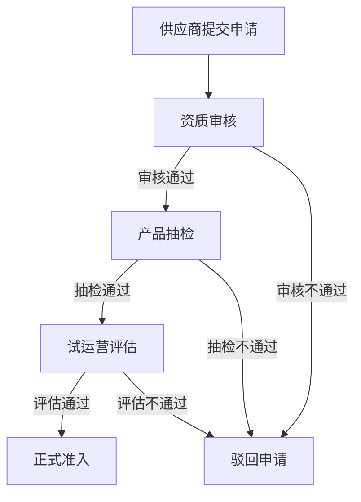
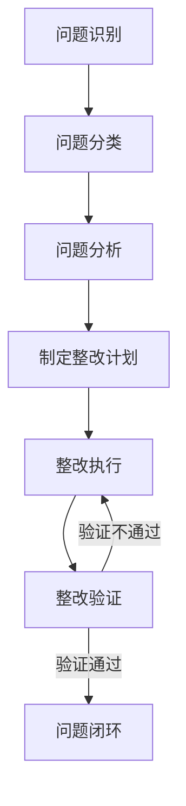
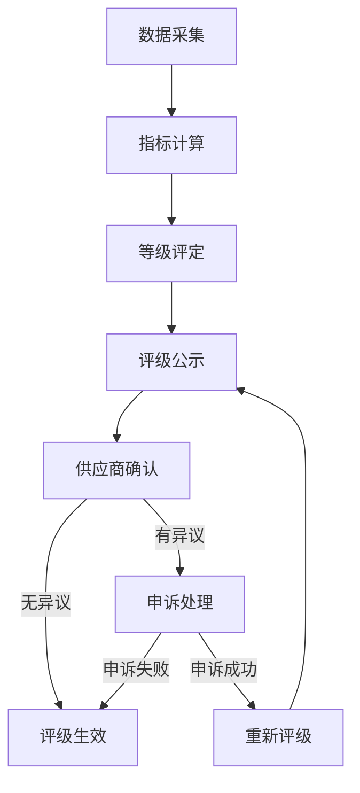

# 商旅平台供应商产品质量体系 PRD

## 1. 文档信息

| 项目 | 内容 |
|------|------|
| 文档名称 | 商旅平台供应商产品质量体系 PRD |
| 版本 | V1.0 |
| 作者 | 产品经理 |
| 日期 | 2025-12-18 |
| 审批人 | [待填写] |

## 2. 产品背景

### 2.1 业务背景
- 商旅平台目前接入供应商数量超过1000家，覆盖酒店、机票、用车、会议等多个品类
- 用户投诉中，供应商产品质量问题占比达45%，主要表现为：产品描述与实际不符、服务态度差、退改政策不合理等
- 现有供应商管理缺乏系统化的质量监控和评级机制，难以有效识别优质供应商和劣质供应商
- 行业竞争加剧，用户对产品质量的要求不断提高，需要建立完善的供应商质量体系以提升用户满意度和平台竞争力

### 2.2 问题痛点
1. **供应商准入标准不明确**：缺乏统一的准入审核流程和标准，导致部分低质量供应商进入平台
2. **质量监控滞后**：主要依赖用户投诉被动发现问题，缺乏主动监控机制
3. **评级体系缺失**：无法科学评估供应商质量，优质供应商得不到激励，劣质供应商得不到有效约束
4. **整改流程不闭环**：发现问题后缺乏有效的跟踪整改机制，问题重复发生
5. **数据支撑不足**：缺乏全面的质量数据收集和分析能力，无法为决策提供有力支持

## 3. 产品目标

### 3.1 总体目标
建立覆盖供应商全生命周期的产品质量体系，实现供应商质量的可控、可管、可优化，提升用户体验和平台竞争力。

### 3.2 具体目标
1. **供应商准入合格率**：提升至95%以上
2. **供应商投诉率**：降低至5%以下
3. **优质供应商占比**：提升至30%以上
4. **问题整改闭环率**：达到100%
5. **用户满意度**：提升至4.5分（满分5分）以上

## 4. 核心功能需求

### 4.1 供应商准入管理

#### 4.1.1 准入流程设计
| 阶段 | 操作 | 责任方 | 工具/系统 |
|------|------|--------|-----------|
| 申请提交 | 供应商提交资质材料 | 供应商 | 供应商自助平台 |
| 资质审核 | 审核营业执照、经营许可证、行业资质等 | 平台审核专员 | 供应商管理系统 |
| 产品抽检 | 对供应商产品进行抽样检查（如酒店实地考察、机票政策审核） | 平台质检团队 | 质检管理系统 |
| 试运营评估 | 供应商进入试运营期（1-3个月），监控产品质量 | 平台运营团队 | 运营监控系统 |
| 准入决策 | 根据试运营数据决定是否正式准入 | 平台评审委员会 | 供应商管理系统 |

#### 4.1.2 准入标准
| 供应商类型 | 核心准入标准 |
|------------|--------------|
| 酒店 | 1. 营业执照、特种行业许可证、卫生许可证齐全 2. 房间数量≥10间 3. 地理位置符合平台要求 4. 近6个月无重大投诉 |
| 机票 | 1. IATA/OTA资质 2. 与主流航司有合作关系 3. 退改政策符合行业标准 4. 价格竞争力达标 |
| 用车 | 1. 道路运输经营许可证 2. 车辆数量≥50辆 3. 司机均有从业资格证 4. 近6个月无重大安全事故 |

### 4.2 质量监控体系

#### 4.2.1 监控指标
| 指标类型 | 具体指标 | 监控频率 | 数据来源 |
|----------|----------|----------|----------|
| 产品一致性 | 1. 描述与实际相符率 2. 图片真实率 3. 价格准确性 | 实时+日度 | 系统数据+人工抽检 |
| 服务质量 | 1. 响应速度 2. 服务态度 3. 问题解决率 | 实时+日度 | 用户评价+客服记录 |
| 履约能力 | 1. 订单完成率 2. 准时率 3. 退改成功率 | 实时 | 订单系统 |
| 用户反馈 | 1. 投诉率 2. 差评率 3. NPS（净推荐值） | 实时+周度 | 用户评价系统 |

#### 4.2.2 监控方式
1. **系统自动监控**：通过API对接各业务系统，实时采集监控指标数据
2. **人工抽检**：定期对供应商产品进行抽样检查，比例不低于5%
3. **用户反馈收集**：通过APP、小程序、客服热线等渠道收集用户反馈
4. **第三方评估**：引入第三方机构进行定期质量评估（每季度1次）

#### 4.2.3 预警机制
- **预警等级**：轻度（黄）、中度（橙）、重度（红）
- **触发条件**：
  - 轻度：单项指标连续3天不达标
  - 中度：单项指标连续7天不达标或多项指标同时不达标
  - 重度：发生重大质量事故或用户集体投诉
- **预警处理**：系统自动发送预警通知给供应商和平台运营人员，根据等级启动相应处理流程

### 4.3 供应商评级体系

#### 4.3.1 评分模型
| 维度 | 权重 | 细分指标 | 指标说明 |
|------|------|----------|----------|
| 产品质量 | 30% | 1. 描述一致性 2. 产品稳定性 3. 合规性 | 产品与描述的符合程度，服务稳定性，是否符合行业规范 |
| 服务能力 | 25% | 1. 响应速度 2. 服务态度 3. 专业水平 | 供应商对订单和问题的响应速度，服务人员态度，业务专业程度 |
| 履约能力 | 20% | 1. 订单完成率 2. 准时率 3. 退改成功率 | 成功完成订单的比例，按时履约的比例，退改请求的处理成功率 |
| 用户评价 | 15% | 1. 好评率 2. 差评率 3. NPS | 用户对产品和服务的评价情况 |
| 合规性 | 10% | 1. 资质合规 2. 政策合规 3. 数据合规 | 供应商资质是否齐全，是否遵守平台政策，数据是否合规 |

#### 4.3.2 等级划分
| 等级 | 评分范围 | 权益 | 管理措施 |
|------|----------|------|----------|
| S级 | 90-100分 | 1. 平台首页优先推荐 2. 佣金优惠5% 3. 专属客户经理 4. 优先参与平台活动 | 季度审核，持续保持优势 |
| A级 | 80-89分 | 1. 优先推荐 2. 佣金优惠3% 3. 专属客户经理 | 季度审核，鼓励升级 |
| B级 | 70-79分 | 1. 正常推荐 2. 标准佣金 | 月度审核，监控波动 |
| C级 | 60-69分 | 1. 限制推荐 2. 佣金上浮3% 3. 重点监控 | 月度审核，要求整改 |
| D级 | 0-59分 | 1. 暂停推荐 2. 佣金上浮5% 3. 强制整改 | 周度审核，整改不达标清退 |

#### 4.3.3 评级更新机制
- **常规更新**：每月更新一次评级
- **触发更新**：发生重大质量事故或用户集体投诉时，立即更新评级
- **升级申请**：供应商可主动申请升级评级，平台在5个工作日内完成审核

### 4.4 奖惩机制

#### 4.4.1 奖励措施
| 等级 | 奖励内容 |
|------|----------|
| S级 | 1. 平台首页Banner推荐 2. 专属营销资源支持 3. 佣金减免5% 4. 优先参与平台战略合 5. 年度优质供应商颁奖 |
| A级 | 1. 优先推荐 2. 佣金减免3% 3. 平台活动优先参与 4. 专属培训机会 |
| B级 | 1. 正常推荐 2. 标准佣金 3. 平台活动参与资格 |

#### 4.4.2 惩罚措施
| 等级 | 惩罚内容 |
|------|----------|
| C级 | 1. 限制推荐流量 2. 佣金上浮3% 3. 责令限期整改（15天） 4. 扣除质量保证金10% |
| D级 | 1. 暂停平台推荐 2. 佣金上浮5% 3. 强制整改（7天） 4. 扣除质量保证金30% 5. 整改不达标清退 |
| 重大违规 | 1. 立即清退 2. 扣除全部质量保证金 3. 纳入平台黑名单 4. 追究法律责任（如适用） |

### 4.5 持续改进流程

#### 4.5.1 问题识别
- 系统自动识别：通过监控指标异常发现问题
- 人工识别：通过抽检、用户投诉等发现问题
- 供应商自查：供应商主动上报问题

#### 4.5.2 问题分析
- 根因分析：采用5Why分析法、鱼骨图等工具分析问题根本原因
- 影响评估：评估问题对用户、平台和供应商的影响范围和程度
- 责任划分：明确问题责任方（供应商、平台或外部因素）

#### 4.5.3 整改计划
- 制定整改方案：明确整改目标、措施、责任人、时间节点
- 方案审核：平台运营团队审核整改方案的可行性和有效性
- 方案执行：供应商按照整改方案执行，平台进行跟踪监控

#### 4.5.4 验证评估
- 整改验证：整改完成后，平台对整改效果进行验证
- 效果评估：评估整改是否达到预期目标
- 持续跟踪：对整改后的供应商进行持续监控，确保问题不再复发

### 4.6 报表与决策支持

#### 4.6.1 核心报表
1. **供应商质量日报**：展示当日供应商质量指标、预警情况、投诉处理情况
2. **供应商质量周报**：分析本周质量趋势、问题分布、整改情况
3. **供应商质量月报**：全面总结本月质量情况、评级变化、奖惩情况
4. **供应商质量年报**：年度质量分析、供应商结构优化建议、下年度质量目标

#### 4.6.2 数据分析功能
1. **趋势分析**：展示质量指标的历史变化趋势
2. **对比分析**：不同供应商、不同品类、不同地区的质量对比
3. **关联分析**：分析质量问题与其他因素（如季节、促销活动）的关联关系
4. **预测分析**：基于历史数据预测未来质量趋势，提前做好预防措施

#### 4.6.3 决策支持
1. **供应商优化建议**：基于质量数据，提出供应商结构优化建议
2. **政策调整建议**：根据质量情况，提出平台政策调整建议
3. **资源配置建议**：建议质量监控资源的合理配置

## 5. 非功能需求

### 5.1 性能需求
- 系统响应时间：≤2秒
- 并发处理能力：支持1000+用户同时在线
- 数据处理能力：每日处理100万+条数据
- 报表生成时间：≤5分钟

### 5.2 安全性需求
- 数据加密：敏感数据（如供应商资质、用户评价）采用AES-256加密存储
- 权限管理：基于角色的访问控制（RBAC），不同角色拥有不同权限
- 审计日志：所有操作均记录审计日志，可追溯
- 数据备份：每日进行全量备份，每周进行增量备份，备份数据保留6个月

### 5.3 可扩展性需求
- 支持新增供应商类型（如签证、保险等）
- 支持新增质量指标和评级维度
- 支持与第三方系统（如征信系统、质检机构系统）的集成

### 5.4 易用性需求
- 操作流程简单直观，培训成本低
- 界面设计符合用户习惯，信息展示清晰
- 提供在线帮助和操作指南
- 支持移动端访问（主要针对预警通知和简单操作）

## 6. 数据需求

### 6.1 数据收集
| 数据类型 | 具体数据 | 收集方式 | 收集频率 |
|----------|----------|----------|----------|
| 供应商基础数据 | 供应商名称、类型、规模、资质、联系方式等 | 供应商提交+人工审核 | 准入时+定期更新 |
| 产品数据 | 产品名称、描述、价格、图片、服务标准等 | 供应商维护+系统监控 | 实时+定期审核 |
| 订单数据 | 订单量、完成率、准时率、退改率等 | 订单系统自动采集 | 实时 |
| 用户反馈数据 | 评价内容、评分、投诉类型、处理结果等 | 用户提交+客服记录 | 实时 |
| 质量监控数据 | 抽检结果、第三方评估报告、整改情况等 | 人工录入+系统自动采集 | 定期+实时 |

### 6.2 数据存储
- 数据库类型：关系型数据库（MySQL）+ 非关系型数据库（MongoDB）
- 数据存储周期：
  - 核心业务数据：永久存储
  - 日志数据：保留1年
  - 临时数据：保留3个月

### 6.3 数据共享
- 与供应商管理系统共享供应商基础数据
- 与订单系统共享订单数据
- 与用户评价系统共享用户反馈数据
- 与财务系统共享佣金调整数据

## 7. 业务流程

### 7.1 供应商准入流程

### 7.2 质量问题处理流程

### 7.3 供应商评级更新流程

## 8. 系统集成需求

### 8.1 内部系统集成
| 系统名称 | 集成内容 | 集成方式 |
|----------|----------|----------|
| 供应商管理系统 | 供应商基础数据、准入流程、评级结果 | API对接 |
| 订单系统 | 订单数据、履约情况 | API对接 |
| 用户评价系统 | 用户反馈数据、评价内容 | API对接 |
| 客服系统 | 投诉处理数据、问题记录 | API对接 |
| 财务系统 | 佣金调整、质量保证金扣除 | API对接 |

### 8.2 外部系统集成
| 系统名称 | 集成内容 | 集成方式 |
|----------|----------|----------|
| 征信系统 | 供应商信用信息查询 | API对接 |
| 质检机构系统 | 第三方质检报告获取 | API对接 |
| 行业监管系统 | 合规信息查询、违规记录查询 | API对接 |

## 9. 验收标准

### 9.1 功能验收
| 功能模块 | 验收标准 |
|----------|----------|
| 供应商准入管理 | 1. 准入流程完整，支持线上操作 2. 资质审核功能正常，支持多种资质类型 3. 产品抽检功能正常，支持抽检结果录入和跟踪 4. 试运营评估功能正常，支持评估指标配置 |
| 质量监控体系 | 1. 监控指标可配置，支持实时采集和展示 2. 预警机制正常，支持不同等级预警 3. 人工抽检功能正常，支持抽检任务分配和结果录入 4. 用户反馈收集功能正常，支持多渠道反馈 |
| 供应商评级体系 | 1. 评分模型可配置，支持权重调整 2. 评级计算准确，支持手动调整 3. 评级结果展示清晰，支持历史查询 4. 评级更新机制正常，支持自动和手动更新 |
| 奖惩机制 | 1. 奖励措施自动执行，支持佣金调整和资源分配 2. 惩罚措施自动执行，支持限流和整改通知 3. 奖惩记录可查询，支持导出 |
| 持续改进流程 | 1. 问题识别功能正常，支持多渠道问题收集 2. 整改计划制定功能正常，支持责任人和时间节点配置 3. 整改跟踪功能正常，支持进度更新和验证 4. 整改效果评估功能正常，支持评估报告生成 |
| 报表与决策支持 | 1. 核心报表生成正常，数据准确 2. 数据分析功能正常，支持多种分析维度 3. 决策支持功能正常，支持优化建议生成 |

### 9.2 非功能验收
| 需求类型 | 验收标准 |
|----------|----------|
| 性能需求 | 1. 系统响应时间≤2秒 2. 并发处理能力支持1000+用户同时在线 3. 数据处理能力每日处理100万+条数据 4. 报表生成时间≤5分钟 |
| 安全性需求 | 1. 敏感数据加密存储 2. 权限管理功能正常，不同角色权限隔离 3. 审计日志完整，可追溯所有操作 4. 数据备份功能正常，支持恢复 |
| 可扩展性需求 | 1. 支持新增供应商类型 2. 支持新增质量指标和评级维度 3. 支持与第三方系统集成 |
| 易用性需求 | 1. 操作流程简单直观，新用户培训时间≤2小时 2. 界面设计符合用户习惯，信息展示清晰 3. 提供在线帮助和操作指南 |

### 9.3 业务目标验收
| 目标类型 | 验收标准 |
|----------|----------|
| 供应商准入合格率 | ≥95% |
| 供应商投诉率 | ≤5% |
| 优质供应商占比 | ≥30% |
| 问题整改闭环率 | 100% |
| 用户满意度 | ≥4.5分 |

## 10. 风险评估与应对措施

| 风险类型 | 风险描述 | 应对措施 |
|----------|----------|----------|
| 供应商抵触 | 供应商对质量体系不理解或抵触 | 1. 加强供应商培训和沟通 2. 提供清晰的质量标准和操作指南 3. 建立供应商反馈渠道，及时解决问题 |
| 数据采集困难 | 部分质量数据难以自动化采集 | 1. 优化数据采集方式，减少人工干预 2. 与相关系统加强集成，实现数据自动流转 3. 建立数据采集规范，确保数据质量 |
| 系统性能问题 | 大数据量下系统性能下降 | 1. 优化数据库设计，建立合理索引 2. 采用分布式架构，提高系统并发处理能力 3. 实施数据缓存策略，减少数据库压力 |
| 质量标准不统一 | 不同品类、不同地区的质量标准难以统一 | 1. 建立差异化的质量标准体系 2. 引入行业专家参与标准制定 3. 定期修订和完善质量标准 |

## 11. 上线计划

| 阶段 | 时间 | 工作内容 |
|------|------|----------|
| 需求评审 | 第1周 | 完成PRD评审，确定最终需求 |
| 设计开发 | 第2-8周 | 完成系统设计、前端开发、后端开发、测试 |
| 内部测试 | 第9周 | 完成系统内部测试，修复bug |
| 试点上线 | 第10周 | 选择部分供应商进行试点上线，收集反馈 |
| 全面上线 | 第11周 | 系统全面上线，面向所有供应商 |
| 运营优化 | 第12周起 | 持续优化系统功能和流程，提升质量体系效果 |

## 12. 附件

### 12.1 术语定义
| 术语 | 定义 |
|------|------|
| 供应商 | 为平台提供产品或服务的企业或个人 |
| 产品质量 | 产品或服务满足用户需求的程度 |
| 准入审核 | 对供应商资质和产品进行审核，决定是否允许其进入平台 |
| 质量监控 | 对供应商产品质量进行持续监控，及时发现问题 |
| 供应商评级 | 根据质量指标对供应商进行评分和等级划分 |
| 整改闭环 | 从问题发现到整改完成并验证的完整流程 |

### 12.2 参考文档
1. 《商旅平台供应商管理规范》
2. 《国家旅游局星级酒店评定标准》
3. 《民航局航空运输服务质量标准》
4. 《道路运输服务质量考核办法》
5. 同行业供应商质量体系最佳实践

### 12.3 联系方式
| 角色 | 姓名 | 联系方式 |
|------|------|----------|
| 产品经理 | [产品经理姓名] | [电话/邮箱] |
| 开发负责人 | [开发负责人姓名] | [电话/邮箱] |
| 测试负责人 | [测试负责人姓名] | [电话/邮箱] |
| 运营负责人 | [运营负责人姓名] | [电话/邮箱] |
